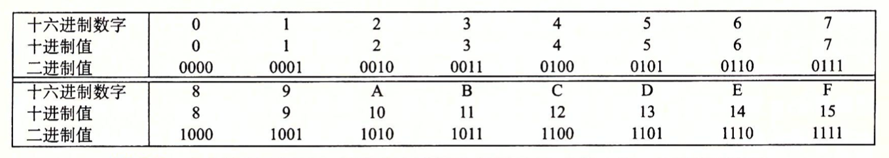
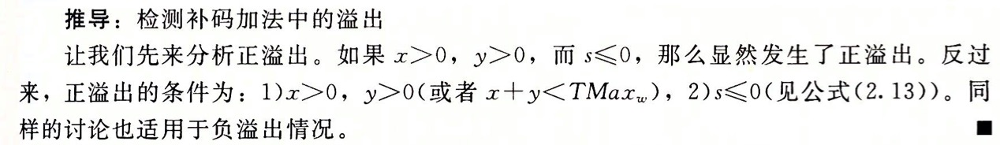
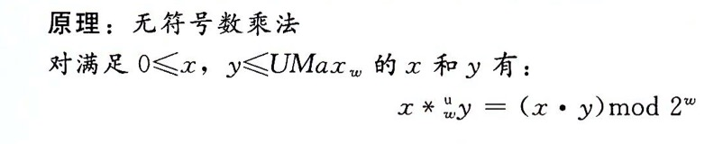

### 十六进制


### 整数表示








### IEEE

V = (-1)<sup>s</sup> &times; M &times; 2<sup>E</sup>
+ 符号 sign
+ 尾数 
+ 阶码


#### 1.规格化的值

E = e - Bias

e是无符号数, Bias=2<sup>k</sup> - 1

M = 1 + f

#### 2.非规格化的值

E = 1 - Bias

M = f


### 练习题

#### 2.12
A. x & 0xFF \
B. x ^ ~0xFF \
C. x | 0xFF

#### 2.13
```c
// e.g. x = 1101, m = 0010, z = 1111
int bis(int x, int m);
// e.g. x = 1101, m = 0100, z = 1001
int bic(int x, int m);

int bool_or(int x, int y) {
    int result = bis(x, y);
    return result;
}

int bool_xor(int x, int y) {
    int result = bis(bic(x, y), bic(y, x));
    return result;
}
```

#### 2.14
x = 0x66, y = 0x39 \
0110 0110, 0011 1001 \
1001 1001, 1100 0110

| 表达式 | 值 |
| ------------- | --- |
| x & y         | 0x20 |
| x &#124; y    | 0x7F |
| ~x &#124; ~y | 0xDF |
| x & !y       |
| x && y       |
| x &#124;&#124; y |
| !x &#124;&#124; !y |
| x && ~y      |

#### 2.15
x == y
!(x ^ y)