## 程序的机器级表示

### 数据格式

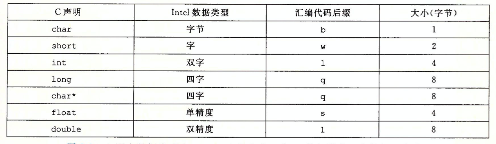


### 通用寄存器

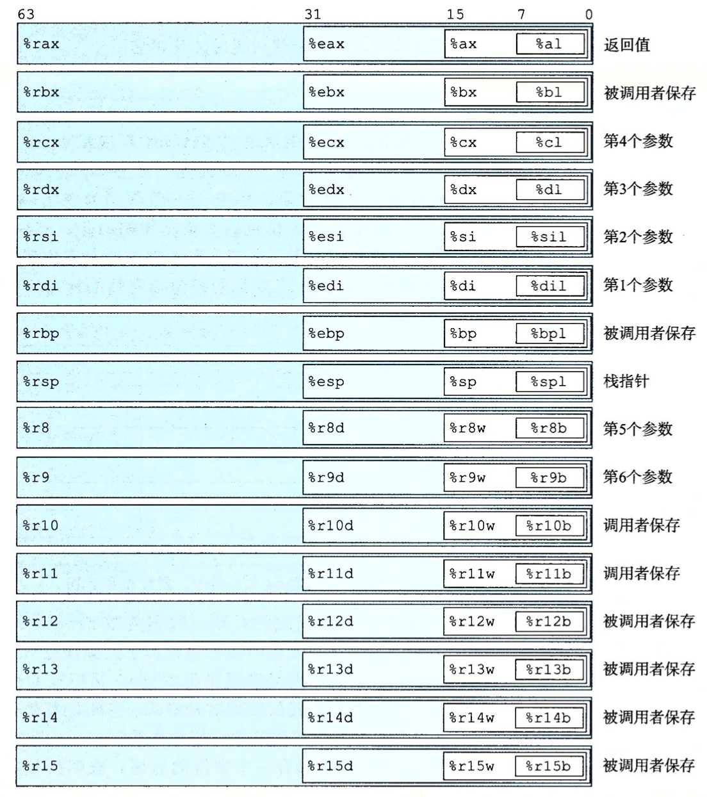
> 当以寄存器为目标时，1、2字节保持剩下的字节不便，4字节时会把高位清零

操作数指示符

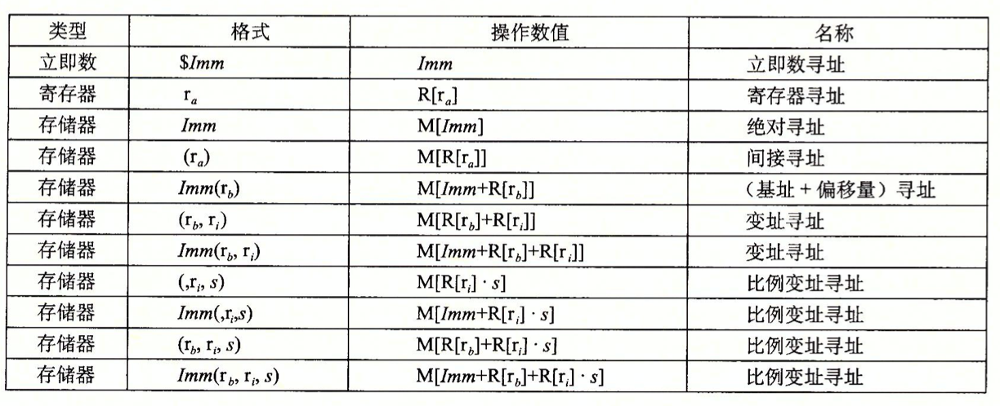

### 数据传动指令

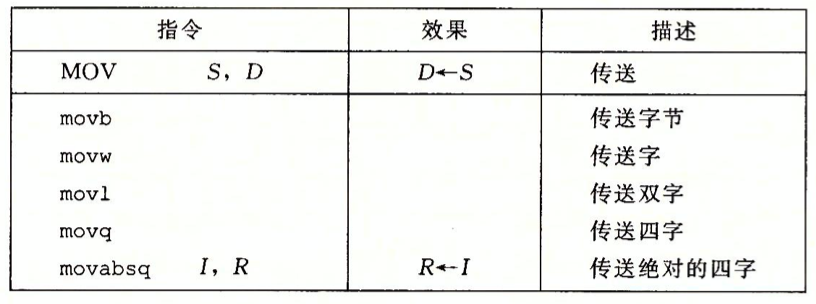

零扩展

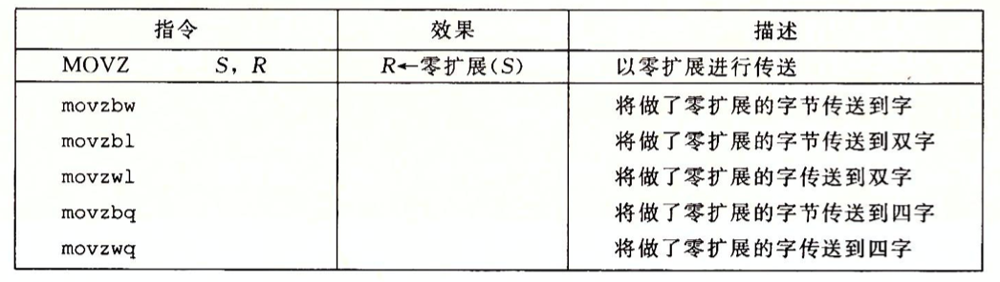

符号扩展

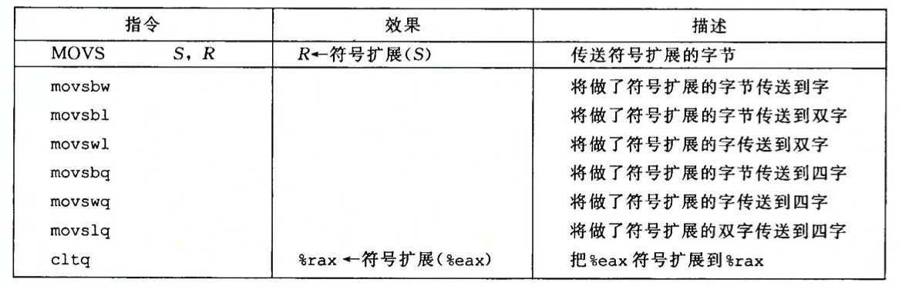

### 栈

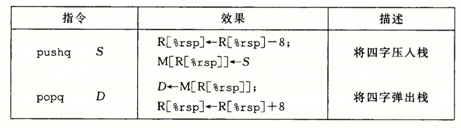

pushq %rbp = \
subq $8, %rsp \
movq %rbp, (%rsp)

popq %rax = \
movq %rax, (%rsp) \
addq $8, %rsp

### 算术和逻辑操作

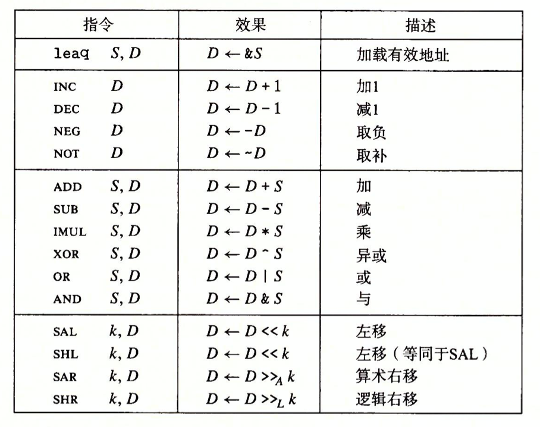

特殊算术操作

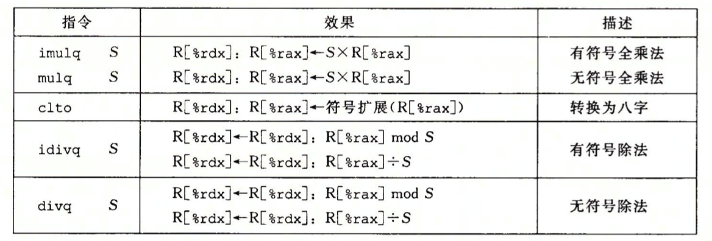

### 控制

条件码

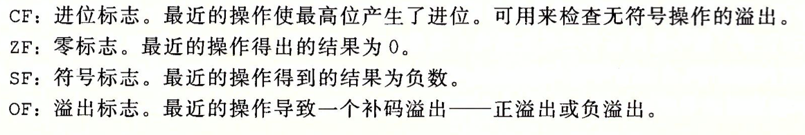

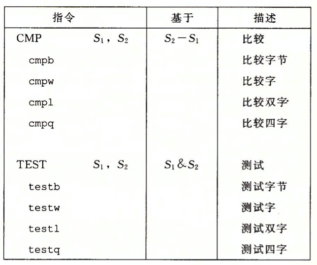

访问条件码

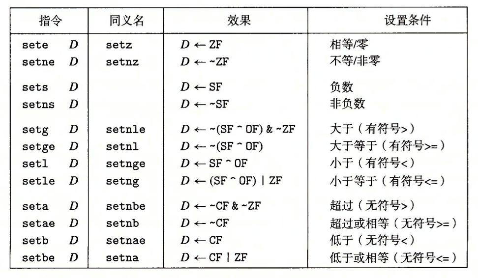

跳转指令

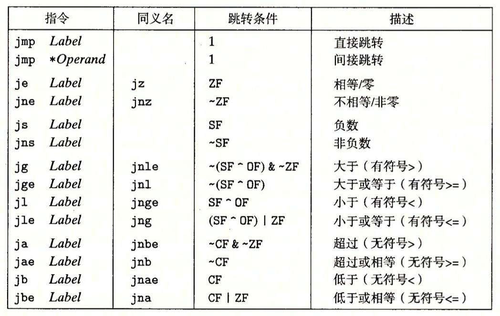

用条件控制来实现条件分支

C语言中 if-else 语句的通用形式模板如下：
```c
if (test-expr) {
    then-statement
} else {
    else-statement
}
```
汇编通常会使用下面这种形式
```c
    t = test-expr;
    if (!t) 
        goto: false;
    then-statement
    goto: done;
false: 
    else-statement
done:
```
用条件指令来实现条件分支

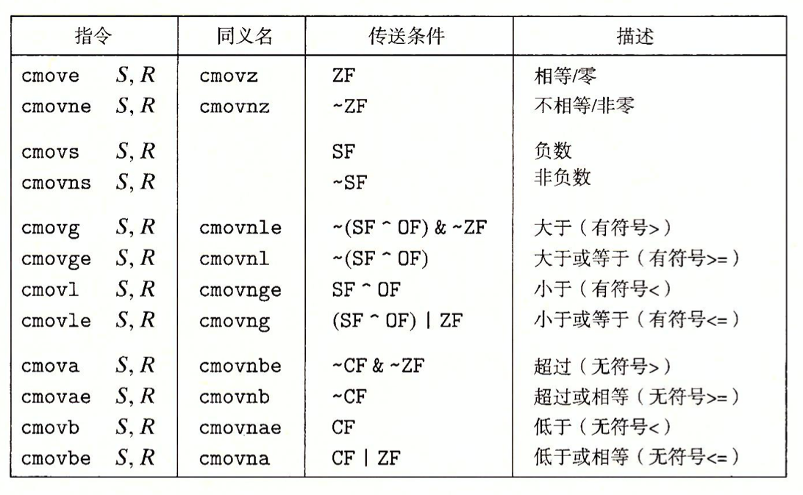

```c
v = test-expr ? then-expr : else-expr

    if (!test-expr)
        goto false;
    v = then-expr;
    goto done;
false:
    v = else-expr;
done:

v = then-expr;
t = test-expr;
ve = else-expr;
if (!t) v = ve;
```

循环
```c
do
    body-statement;
while(test-expr);

loop:
    body-statement;
    t = test-expr;
    if (t)
        goto loop;
```

```c
while(test-expr)
    body-statement;

    goto test;
loop: 
    body-statement;
test:
    t = test-expr;
    if (t)
        goto loop;
```
```c
for (init-expr; test-expr; update-expr)
    body-statement;

init-expr;
while (test-expr)
    body-statement;
    update-expr;

// 中间策略
    init-expr;
    goto test;
loop: 
    body-statement;
    update-expr;
test:
    t = test-expr;
    if (t)
        goto loop;

// guarded-do
    init-expr;
    t = test-expr;
    if (!t)
        goto done;
loop: 
    body-statement;
    update-expr;
    t = test-expr;
    if (t)
        goto loop;
done:
```

switch语句


