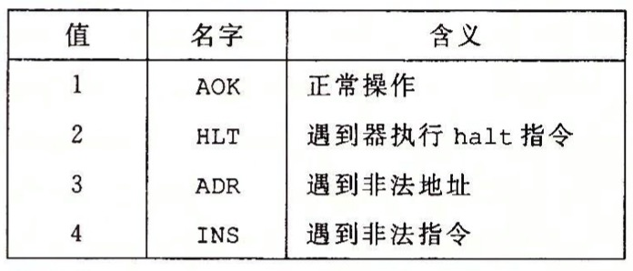
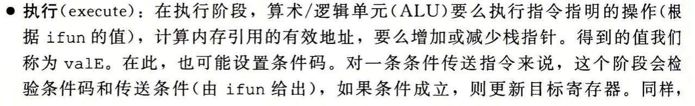

## 处理器体系结构

**Y86-64**

+ Y86-64的movq指令：irmovq、rrmovq、mrmovq、rmmovq分别显示的指明源和目的的格式。立即数i、寄存器r或内存m。
不允许从一个内存地址直接传动到另一个内存地址
+ 有4个整数操作指令 addq、subq、andq、xorq。这些指令会设置3个条件码ZF、SF和OF（零、符号和溢出）
+ 7个跳转指令 jmp、jle、jl、je、jne、jge、jg
+ 6个条件传送指令：cmovle、cmovl、cmove、cmovne、cmovge和cmovg
+ call指令和ret指令
+ pushq和popq
+ halt指令停止指令的执行

### 指令编码
每条指令第一个字节表明指令的类型，高4位是代码部分，低4位是功能部分

**e.g.**\
rmmovq %rsp, 0x123456789abcd(%rdx)
4042cdab896745230100

### Y86-64异常

## Y86-64的顺序实现

### 将处理组织成阶段

e.g.

###练习题
